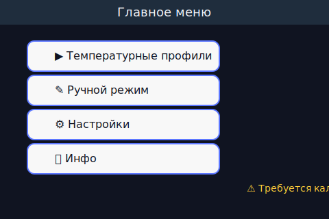
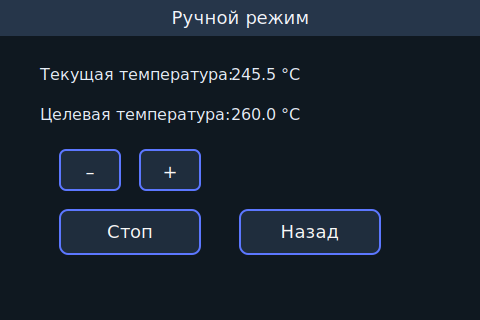
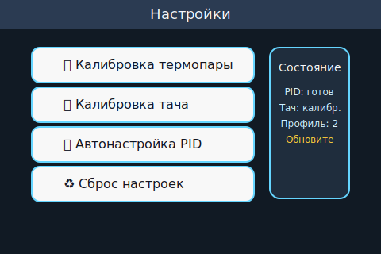
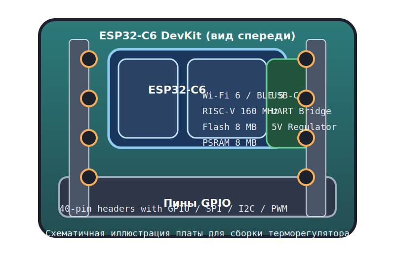

# AKTex TempRegulator

AKTex TempRegulator — прошивка регулятора температуры на базе ESP32 с полнофункциональным графическим интерфейсом на LVGL.
Устройство предназначено для сушильных камер, паяльных станций, печей оплавления и других установок, где требуется
поддерживать точный температурный профиль при помощи термопары и твердотельного реле. Прошивка развёртывается на ESP32,
включает собственный HMI с сенсорным экраном/энкодером и работает автономно без постоянного подключения к ПК. 【F:TempRegulator.cpp†L480-L537】【F:tempregulator_new_libV5.1.ino†L1-L11】

## Основные возможности

- **Автономное управление нагревом**: PID-регулятор с ограничением диапазона, ручной и программный режимы, защита от
  выбросов датчика. 【F:PIDController.cpp†L5-L41】【F:TempRegulator.cpp†L200-L247】
- **Температурные профили**: хранение до 10 сценариев в энергонезависимой памяти с индивидуальными коэффициентами PID и
  коррекциями термопары. 【F:TempRegulator.cpp†L240-L280】【F:TemperatureProfile.cpp†L19-L149】
- **Графический интерфейс**: меню для выбора профилей, ручного управления, настроек и информационных окон; поддержка
  сенсорного ввода и аппаратного энкодера. 【F:TempRegulator.cpp†L320-L401】【F:TempRegulator.cpp†L520-L607】【F:EncoderInput.cpp†L1-L79】
- **Мастера настройки**: пошаговые диалоги для калибровки термопары, тачскрина, автонастройки PID, сброса конфигурации и
  отображения аварий. 【F:TempRegulator.cpp†L160-L239】【F:TouchCalibration.cpp†L1-L39】【F:Storage.cpp†L82-L178】
- **Хранилище LittleFS**: сохранение пользовательских параметров, калибровочных коэффициентов и заставок. 【F:Storage.cpp†L8-L178】【F:TempRegulator.cpp†L360-L420】
- **Пользовательская заставка**: загрузка `splash.bin` из LittleFS либо встроенного логотипа для экрана приветствия.
  【F:TempRegulator.cpp†L360-L420】【F:tools/make_splash_bin.py†L1-L152】

## Архитектура прошивки

Проект разделён на независимые модули, что облегчает поддержку и адаптацию под конкретное устройство. Ниже приведены основные
компоненты прошивки и вспомогательные ресурсы.

### Исходный код (Arduino/C++)

| Файл | Назначение |
|------|------------|
| [`tempregulator_new_libV5.1.ino`](tempregulator_new_libV5.1.ino) | Точка входа Arduino: настройка Serial, инициализация файловой системы и запуск контроллера интерфейса. 【F:tempregulator_new_libV5.1.ino†L1-L11】 |
| [`TempRegulator.cpp`](TempRegulator.cpp) / [`TempRegulator.h`](TempRegulator.h) | Главный класс приложения: создание экранов LVGL, обработка событий, логика нагрева, мастера калибровки и режимов. 【F:TempRegulator.cpp†L200-L607】【F:TempRegulator.h†L1-L78】 |
| [`PIDController.cpp`](PIDController.cpp) / [`PIDController.h`](PIDController.h) | Реализация PID с антивиндапом, ограничением мощности и защитой от скачков времени выборки. 【F:PIDController.cpp†L5-L41】【F:PIDController.h†L1-L48】 |
| [`TemperatureProfile.cpp`](TemperatureProfile.cpp) / [`TemperatureProfile.h`](TemperatureProfile.h) | Работа с профилями нагрева: хранение в `Preferences`, генерация значений по умолчанию, валидация шагов. 【F:TemperatureProfile.cpp†L19-L149】【F:TemperatureProfile.h†L1-L83】 |
| [`Storage.cpp`](Storage.cpp) / [`Storage.h`](Storage.h) | Обёртка над LittleFS: чтение/запись `config.ini`, миграция версий, буферизация структур калибровки. 【F:Storage.cpp†L8-L178】【F:Storage.h†L1-L86】 |
| [`DisplayDriver.cpp`](DisplayDriver.cpp) / [`DisplayDriver.h`](DisplayDriver.h) | Инициализация LovyanGFX для TFT ILI9341, настройка буферов LVGL и обработка тачскрина XPT2046. 【F:DisplayDriver.cpp†L1-L119】【F:DisplayDriver.h†L1-L75】 |
| [`EncoderInput.cpp`](EncoderInput.cpp) / [`EncoderInput.h`](EncoderInput.h) | Обработка энкодера через `esp_timer`, подавление дребезга, интеграция с LVGL encoder indev. 【F:EncoderInput.cpp†L1-L120】【F:EncoderInput.h†L1-L63】 |
| [`TouchCalibration.cpp`](TouchCalibration.cpp) / [`TouchCalibration.h`](TouchCalibration.h) | Математика преобразования координат и хранение коэффициентов калибровки сенсора. 【F:TouchCalibration.cpp†L1-L39】【F:TouchCalibration.h†L1-L79】 |
| [`LogoImageBuiltin.cpp`](LogoImageBuiltin.cpp) / [`LogoImageBuiltin.h`](LogoImageBuiltin.h) / [`LogoImageBuiltinData.inc`](LogoImageBuiltinData.inc) | Встроенная заставка, используемая при отсутствии `splash.bin` в LittleFS. 【F:TempRegulator.cpp†L360-L420】 |
| [`HardwareConfig.h`](HardwareConfig.h) | Централизованная распиновка: SPI, термопара, SSR, светодиоды, энкодер и т.д. 【F:HardwareConfig.h†L1-L20】 |

### Конфигурация и ресурсы

| Файл/каталог | Содержимое |
|--------------|------------|
| [`lv_conf.h`](lv_conf.h) | Параметры сборки LVGL (размер буфера, поддержка файлов, шрифтов и вводов). 【F:lv_conf.h†L1-L200】 |
| [`logo.c`](logo.c) / [`montserrat_16_cyr.c`](montserrat_16_cyr.c) | Скомпилированные шрифты и логотип для отображения в интерфейсе. 【F:logo.c†L1-L81】【F:montserrat_16_cyr.c†L1-L360】 |
| [`data/`](data/) | Файлы, которые прошиваются в LittleFS (`config.ini`, `splash.bin`). 【F:data/config.ini†L1-L13】 |
| [`docs/screenshots/`](docs/screenshots/) | SVG-эскизы экранов интерфейса для документации. |
| [`docs/hardware/`](docs/hardware/) | Иллюстрации печатных плат и монтажных схем (например, ESP32-C6 DevKit). 【F:docs/hardware/esp32-c6-devkit.svg†L1-L40】 |
| [`tools/`](tools/) | Утилиты для подготовки ресурсов, включая генератор заставки `make_splash_bin.py`. 【F:tools/make_splash_bin.py†L1-L152】 |

## Пользовательский интерфейс (HMI)

Интерфейс построен на LVGL 9 и поддерживает как сенсорное управление, так и навигацию энкодером (через LVGL groups).
Ниже представлены основные экраны:

| Главное меню | Ручной режим | Настройки |
|--------------|--------------|-----------|
|  |  |  |

### Навигация
- **Главное меню**: быстрый доступ к списку профилей, ручному управлению, настройкам и окну информации. 【F:TempRegulator.cpp†L480-L537】
- **Ручной режим**: изменение целевой температуры кнопками/энкодером, запуск и остановка нагрева. 【F:TempRegulator.cpp†L200-L231】【F:TempRegulator.cpp†L560-L607】
- **Настройки**: вызов мастеров калибровки, автонастройки PID, сброса параметров. 【F:TempRegulator.cpp†L160-L239】【F:TempRegulator.cpp†L607-L640】

## Аппаратные требования

| Узел | Требования |
|------|------------|
| Микроконтроллер | ESP32-WROOM/ESP32-WROVER с минимум 4 МБ флеша и поддержкой LittleFS. |
| Дисплей | TFT 320×240 на контроллере ILI9341 по SPI. 【F:DisplayDriver.cpp†L9-L60】 |
| Тач-панель | XPT2046 или совместимая, подключение по SPI. 【F:DisplayDriver.cpp†L60-L110】 |
| Датчик | Термопара с усилителем (MAX31855/MAX6675 или аналог) на аналоговом входе `THERMOCOUPLE_PIN`. 【F:HardwareConfig.h†L13-L17】 |
| Исполнитель | SSR-реле для нагревателя + опциональный вход обратной связи. 【F:HardwareConfig.h†L13-L17】 |
| Индикация | RGB-светодиод и пьезоизлучатель для звуковых сигналов. 【F:HardwareConfig.h†L17-L19】 |
| Ввод | Роторный энкодер с кнопкой (резервный ввод, если сенсор неактивен). 【F:EncoderInput.cpp†L1-L120】 |

### Назначение пинов (по умолчанию)

| Периферия | Пины |
|-----------|------|
| SPI (SCLK/MOSI/MISO) | `PIN_SCLK = 6`, `PIN_MOSI = 7`, `PIN_MISO = 2` |
| TFT-дисплей | `PIN_TFT_CS = 10`, `PIN_TFT_DC = 4`, `PIN_TFT_RST = 5` |
| Тачскрин | `PIN_TOUCH_CS = 21` (шина SPI общая) |
| Энкодер | `ENCODER_A = 11`, `ENCODER_B = 3`, `ENCODER_BTN = 8` |
| Нагреватель | `SSR_CONTROL_PIN = 19`, `SSR_FEEDBACK_PIN = 20` |
| Датчик температуры | `THERMOCOUPLE_PIN = 1` |
| Сигнализация | `BUZZER_PIN = 18`, `LED_R/G/B = 15/16/17` |

При изменении разводки обновите [`HardwareConfig.h`](HardwareConfig.h) и заново выполните калибровку. 【F:HardwareConfig.h†L1-L20】【F:TouchCalibration.cpp†L1-L39】

### Иллюстрация ESP32-C6 DevKit

Для сборки можно использовать современную плату **ESP32-C6 DevKit** (RISC-V, Wi‑Fi 6/Thread/BLE). На схеме ниже показано
расположение основных узлов и коннекторов, к которым подключаются дисплей, сенсор и силовая часть:



*Примечание: изображение схематичное, предназначено для пояснения расположения узлов при проектировании корпуса и проводки.*

## Используемые библиотеки и компоненты

| Библиотека | Назначение |
|------------|------------|
| **LVGL 9.x** | Рисование интерфейса, управление экранами, анимациями и вводом. Основная логика UI находится в `TempRegulator.cpp`. 【F:TempRegulator.cpp†L200-L607】 |
| **LovyanGFX** | Низкоуровневый драйвер TFT и тачскрина, обеспечивает двойную буферизацию и DMA. 【F:DisplayDriver.cpp†L1-L110】 |
| **LittleFS (ESP32)** | Встроенная файловая система для `config.ini`, заставок и пользовательских данных. 【F:Storage.cpp†L8-L178】【F:TempRegulator.cpp†L360-L420】 |
| **Arduino Preferences** | Хранение температурных профилей по умолчанию в NVS. 【F:TemperatureProfile.cpp†L19-L117】 |
| **ESP-IDF esp_timer/gpio** | Высокоточный таймер и быстрый доступ к GPIO для работы энкодера без лагов. 【F:EncoderInput.cpp†L1-L70】 |
| **Стандартная библиотека C++** | STL (vector, string, algorithm) для вспомогательных задач в UI и хранении данных. 【F:TempRegulator.cpp†L1-L39】 |

## Подготовка рабочего окружения

1. **Клонирование репозитория**
   ```bash
   git clone https://github.com/your-org/AKtex-TempRegulator.git
   cd AKtex-TempRegulator
   ```
2. **Проверка содержимого**: убедитесь, что каталоги `data/`, `docs/`, `tools/` присутствуют и доступны.
3. **Установка Python 3.9+** (используется для генерации заставки). 【F:tools/make_splash_bin.py†L1-L152】

### Вариант 1. Arduino IDE 2.x

1. Откройте *File → Preferences* и добавьте URL платформы ESP32: `https://espressif.github.io/arduino-esp32/package_esp32_index.json`.
2. В *Tools → Board → Boards Manager* установите «ESP32 by Espressif Systems». Рекомендуется версия 3.x.
3. Через *Tools → Manage Libraries* установите библиотеки **LVGL 9**, **LovyanGFX**, **LittleFS_esp32**.
4. Создайте новый скетч `tempregulator_new_libV5.1` и скопируйте в его папку все файлы из репозитория (включая `.cpp/.h`).
5. В меню *Tools* выберите вашу плату (например, *ESP32 Dev Module*) и порт.
6. Для работы с LittleFS установите плагин [ESP32 LittleFS Data Upload](https://github.com/lorol/arduino-esp32fs-plugin) и
   перезапустите IDE.

### Вариант 2. PlatformIO (VS Code или CLI)

1. Установите [Visual Studio Code](https://code.visualstudio.com/) и расширение PlatformIO или пакет `pip install platformio`.
2. Создайте проект для платы `esp32dev` и фреймворка Arduino, затем замените папку `src/` файлами репозитория.
3. Пример `platformio.ini`:
   ```ini
   [env:aktex-tempregulator]
   platform = espressif32
   board = esp32dev
   framework = arduino
   build_flags = -DLV_CONF_INCLUDE_SIMPLE
   monitor_speed = 115200
   lib_deps =
     lvgl@^9.0.0
     lovyangfx
     LittleFS_esp32
   ```
4. Выполните `pio pkg update` и `pio run` для проверки сборки.
5. Для загрузки LittleFS используйте `pio run -t uploadfs`.

### Общие рекомендации

- Скорость последовательного монитора — 115200 бод. 【F:tempregulator_new_libV5.1.ino†L5-L9】
- Для Mac/Linux используйте `python3`, на Windows — `py` или `python` в зависимости от конфигурации.
- При использовании внешних библиотек убедитесь, что они обновлены до версий, совместимых с LVGL 9.

## Сборка, прошивка и обновление

1. **Сборка прошивки**: выполните `Sketch → Verify` (Arduino) или `pio run` (PlatformIO).
2. **Прошивка**: загрузите код (`Sketch → Upload` или `pio run -t upload`).
3. **LittleFS**: после каждой правки `data/` выполните `ESP32 LittleFS Data Upload` или `pio run -t uploadfs`. Без этой
   операции калибровка и заставка не будут доступны. 【F:Storage.cpp†L8-L178】【F:TempRegulator.cpp†L360-L420】
4. **Перезагрузка**: по завершении прошивки устройство автоматически перезапускается и выводит логи в Serial Monitor.

### Файловая система LittleFS

Каталог [`data/`](data/) синхронизируется с внутренней памятью платы. Основные файлы:

| Файл | Описание |
|------|----------|
| [`config.ini`](data/config.ini) | Параметры PID, сдвиг термопары, коэффициенты тач-калибровки. 【F:data/config.ini†L1-L13】 |
| `splash.bin` | Пользовательская заставка (320×240 RGB565, с 4-байтовым заголовком ширины/высоты). 【F:TempRegulator.cpp†L360-L420】 |

#### Формат `config.ini`

| Ключ | Значение |
|------|----------|
| `version` | Версия файла, должна совпадать с `Storage::kConfigVersion`. 【F:Storage.cpp†L8-L110】 |
| `calibrated` | Флаг калибровки термопары (0/1). 【F:Storage.cpp†L106-L178】 |
| `offset`, `slope` | Линейная коррекция датчика (смещение и наклон). 【F:Storage.cpp†L120-L156】 |
| `kp`, `ki`, `kd` | Коэффициенты PID по умолчанию. 【F:Storage.cpp†L134-L156】 |
| `touch_*` | Результаты калибровки тачскрина (границы АЦП и перестановка осей). 【F:TouchCalibration.cpp†L1-L39】【F:Storage.cpp†L134-L178】 |

#### Генерация `splash.bin`

1. Подготовьте изображение 320×240.
2. Выполните `python3 tools/make_splash_bin.py --input path/to/logo.png` (по умолчанию используется встроенный логотип).
3. Скопируйте полученный файл в `data/splash.bin` и загрузите LittleFS.
4. При отсутствии файла прошивка использует запасной логотип из `LogoImageBuiltin`. 【F:TempRegulator.cpp†L360-L420】

## Температурные профили

- Настройки профилей (название, шаги, коэффициенты) хранятся в NVS (`Preferences`). 【F:TemperatureProfile.cpp†L19-L149】
- Прошивка автоматически создаёт два профиля по умолчанию («Быстрый разогрев», «Медленный прогрев») при первом запуске. 【F:TemperatureProfile.cpp†L19-L68】【F:TemperatureProfile.cpp†L119-L149】
- Каждый профиль содержит до 10 этапов (`MAX_ROWS`) с температурой начала/конца и длительностью в минутах. 【F:TemperatureProfile.cpp†L23-L38】【F:TemperatureProfile.cpp†L90-L117】
- Чтобы добавить новые сценарии, используйте сторонний скрипт для записи в NVS либо расширьте код `ensureDefaultTemperatureProfiles()`.

## Калибровка и первое включение

1. При первом запуске отображается заставка, затем мастер калибровки тачскрина (если данные отсутствуют). 【F:TempRegulator.cpp†L360-L420】
2. После калибровки пользователь попадает в тест тача и главное меню. 【F:TempRegulator.cpp†L320-L401】
3. Перед запуском профиля рекомендуется выполнить калибровку термопары через меню «Настройки → Калибровка термопары»:
   - шаг 1: измерение комнатной температуры,
   - шаг 2: измерение опорной точки (например, кипящей воды).
4. Для автоматического подбора PID воспользуйтесь пунктом «Автонастройка PID».
5. Все результаты сохраняются в LittleFS (`config.ini`). 【F:Storage.cpp†L120-L178】

## Режимы работы

- **Температурные профили**: устройство исполняет выбранный сценарий, управляя нагревом через SSR с оконным методом.
  При отклонении показаний и отсутствии калибровки отображаются предупреждения. 【F:TempRegulator.cpp†L200-L288】【F:TempRegulator.cpp†L401-L507】
- **Ручной режим**: оператор напрямую задаёт целевую температуру, PID поддерживает значение в диапазоне 40–500 °C.
  【F:TempRegulator.cpp†L200-L239】
- **Оповещения**: красный треугольник сигнализирует об аварии (ошибка датчика), синий — о пропущенной калибровке. 【F:TempRegulator.cpp†L401-L458】

## Диагностика и отладка

- Серийный порт (115200 бод) выводит диагностические сообщения, включая ошибки LittleFS, состояние калибровки и профилей. 【F:tempregulator_new_libV5.1.ino†L5-L9】【F:TempRegulator.cpp†L360-L420】
- При необходимости можно включить отладочный вывод LVGL, добавив соответствующие макросы в `lv_conf.h`.
- Для анализа сбросов используйте встроенный монитор PlatformIO (`pio device monitor`) или `idf.py monitor`.

## Структура репозитория

```
AKtex-TempRegulator/
├── data/                  # Файлы LittleFS (config.ini, splash.bin)
├── docs/screenshots/      # Эскизы экранов для документации
├── docs/hardware/         # Иллюстрации плат и монтажных схем
├── tools/                 # Скрипты, например генератор заставки
├── *.cpp, *.h             # Исходный код модулей прошивки
├── lv_conf.h              # Конфигурация LVGL
├── logo.c, montserrat_16_cyr.c # Ресурсы шрифтов и логотипов
└── README.md              # Текущее описание проекта
```

## Как внести вклад

1. Форкните репозиторий и создайте рабочую копию.
2. Придерживайтесь стиля кода (комментарии и форматирование как в существующих модулях).
3. При добавлении новых экранов обновляйте описания и скриншоты в `docs/screenshots/`.
4. Перед Pull Request убедитесь, что:
   - проект собирается (Arduino/PlatformIO),
   - LittleFS обновлён и содержит необходимые файлы,
   - README отражает внесённые изменения.
5. Об ошибках и предложениях сообщайте через Issues или электронную почту авторов.

Удачной работы с AKTex TempRegulator!
